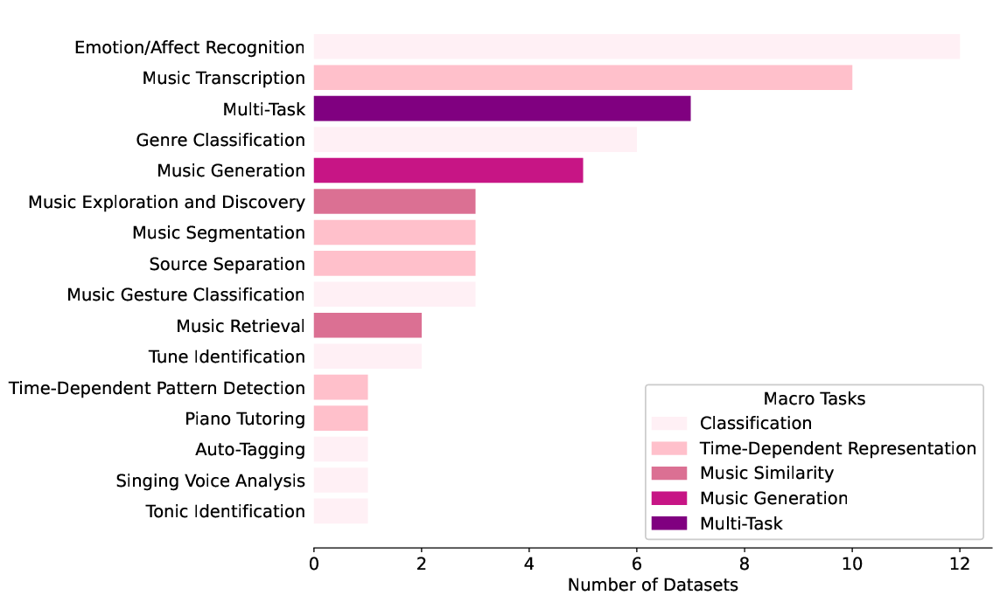

# Multimodal Music Datasets? Challenges and Future Goals in Music Processing

[](https://opensource.org/licenses/MIT)
[](https://doi.org/10.1007/s13735-024-00344-6)

[Anna-Maria Christodoulou](https://www.uio.no/ritmo/english/people/phd-fellows/annammc/index.html)<sup>1</sup>, 
[Olivier Lartillot](https://www.uio.no/ritmo/english/people/tenured/oliviel/index.html)<sup>1</sup>,
[Alexander Refsum Jensenius](https://www.uio.no/ritmo/english/people/management/alexanje/index.html)<sup>1</sup>,

<sup>1</sup> RITMO, UiO 


This repository contains information and supplementary materials for the paper titled "Defining Multimodal Music Datasets and Addressing Challenges in Their Construction and Evaluation."

## Abstract
The term "multimodal music dataset" is frequently utilized to depict music-related data representing music as a multimedia art form and a multimodal experience. However, the interpretation of "multimodality" can vary across related disciplines such as musicology, music psychology, and music technology. This paper proposes a comprehensive definition of multimodality that is applicable across different music disciplines. It addresses various challenges associated with constructing, evaluating, and utilizing multimodal music datasets. Additionally, the paper categorizes these datasets based on tasks and explores theoretical methodologies aimed at improving their future construction. It also sheds light on diverse data preprocessing methods and their contributions to transparent music analysis. Furthermore, evaluation metrics, methods, and benchmarks tailored for multimodal music processing tasks are scrutinized, empowering researchers to make informed decisions and facilitating cross-study comparisons.

## TABLE 1: 

Overview of Multimodal Music Datasets Across Macro Tasks (Categories top to bottom: 1. Classification, 2. Time-Dependent Representation, 3. Similarity, 4. Generation, 5. Multi-Task). This table provides a comprehensive summary of specific tasks, modalities (AUD = audio, ANN = Annotation of Notes, ANO = Annotations of other music elements, IMG = Images, LAB = Labels, LYR = lyrics, MCP = Motion Capture, PHY = Physiological, MSC = Scores, TXD = Text Descriptions, VID = Video), and dataset examples within the Music Processing domain, offering insights into the diverse applications of multimodal approaches.

| Specific Task                   | Modalities                                          | Datasets                                                                       |
|---------------------------------|-----------------------------------------------------|--------------------------------------------------------------------------------|
| **Emotion/Affect Recognition**  | AUD, LAB, LYR, PHY                                 | AMC, CAL500, EmoMV, IMAC, TROMPA-MER, MERP, NAVER Music, PMEmo, Hu et al., Laurier et al., Trochidis et al., Turnbull et al. |
|                                 |                                                     |                                                                                |
| **Genre Classification**        | AUD, LAB, LYR, VID                                 | LMD-ALigned, MSD-I, MuMu, Mayer et al., Orio et al., Schindler et al.         |
|                                 |                                                     |                                                                                |
| **Tonic Identification**        | AUD, ANO                                            | Turkish Makam Music                                                           |
|                                 |                                                     |                                                                                |
| **Tune Identification**         | AUD, ANO                                            | CompMusic Art Indian Music, Saraga Music Research                             |
|                                 |                                                     |                                                                                |
| **Music Gesture Classification**| AUD, EMG, IMG, IMU, MSC, TXT, VID                  | Sarasua Datasets, Chang et al., Gan et al.                                    |
|                                 |                                                     |                                                                                |
| **Singing Voice Analysis**      | Speech, Voice                                      | Vocal92                                                                        |
|                                 |                                                     |                                                                                |
| **Auto-Tagging**                | AUD, ANO                                            | MTG-Jamendo                                                                    |
|---------------------------------|-----------------------------------------------------|--------------------------------------------------------------------------------|
| **Source Separation**           | AUD, MSC                                            | CocoChorales, MUSIC-21, TRIOS                                                 |
|                                 |                                                     |                                                                                |
| **Piano Tutoring**              | AUD, MSC                                            | Benetos et al.                                                                 |
|                                 |                                                     |                                                                                |
| **Music Segmentation**          | AUD, ANO, MSC                                       | Cheng et al., Hargreaves, Gregorio et al.                                      |
|                                 |                                                     |                                                                                |
| **Music Transcription**         | AUD, ANN, MSC                                       | Camera-PrIMuS, CocoChorales, MAPS, MedleyDB, MIREX, MIREX multi-f0, Norwegian Hardanger Fiddle, Alfaro-Contreras et al., Gu et al., Poliner et al. |
|                                 |                                                     |                                                                                |
| **Time-Dependent Pattern Detection** | AUD, MCP, MSC                                  | Kronland-Martinet et al.                                                      |
|---------------------------------|-----------------------------------------------------|--------------------------------------------------------------------------------|
| **Music Retrieval**             | AUD, LAB, LYR                                       | MSD, MSD-500                                                                  |
|                                 |                                                     |                                                                                |
| **Music Exploration and Discovery** | AUD, ANO, LAB, TXT                             | Music4All-Onion, Poltronieri, Watanabe et al.                              |
|---------------------------------|-----------------------------------------------------|--------------------------------------------------------------------------------|
| **Music Generation**             | AUD, VID                                            | AtinPiano, MUSIC, MusicCaps, URMP, Groux et al.                               |
|---------------------------------|-----------------------------------------------------|--------------------------------------------------------------------------------|
| **Multiple Specific Tasks**     | AUD, IMG, MCP, MSC, TXT, VID                      | DALI, ENST-Drums, FMA, RWC, SDD, URMP, Essid et al.                            |

# Dataset Availability




## Citation

If you find this useful for your research, please consider citing our work:

```bibtex
@article{christodoulou_multimodal_2024,
	title = {Multimodal music datasets? {Challenges} and future goals in music processing},
	volume = {13},
	issn = {2192-662X},
	shorttitle = {Multimodal music datasets?},
	url = {https://doi.org/10.1007/s13735-024-00344-6},
	doi = {10.1007/s13735-024-00344-6},
	number = {3},
	urldate = {2024-08-29},
	journal = {International Journal of Multimedia Information Retrieval},
	author = {Christodoulou, Anna-Maria and Lartillot, Olivier and Jensenius, Alexander Refsum},
	month = aug,
	year = {2024},
	pages = {37},
}
```

For any inquiries or suggestions, please contact [a.m.christodoulou@imv.uio.no].
