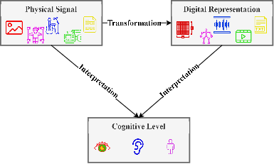
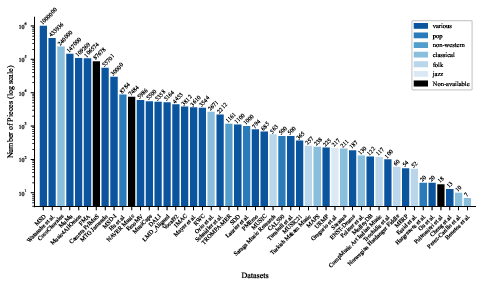

# Multimodal Music Datasets? Challenges and Future Goals in Music Processing

[](https://opensource.org/licenses/MIT)
[](https://doi.org/10.1007/s13735-024-00344-6)

[Anna-Maria Christodoulou](https://www.uio.no/ritmo/english/people/phd-fellows/annammc/index.html)<sup>1</sup>, 
[Olivier Lartillot](https://www.uio.no/ritmo/english/people/tenured/oliviel/index.html)<sup>1</sup>,
[Alexander Refsum Jensenius](https://www.uio.no/ritmo/english/people/management/alexanje/index.html)<sup>1</sup>,

<sup>1</sup> RITMO, UiO 


This repository contains information and supplementary materials for the paper titled "Defining Multimodal Music Datasets and Addressing Challenges in Their Construction and Evaluation."



## Abstract
The term "multimodal music dataset" is frequently utilized to depict music-related data representing music as a multimedia art form and a multimodal experience. However, the interpretation of "multimodality" can vary across related disciplines such as musicology, music psychology, and music technology. This paper proposes a comprehensive definition of multimodality that is applicable across different music disciplines. It addresses various challenges associated with constructing, evaluating, and utilizing multimodal music datasets. Additionally, the paper categorizes these datasets based on tasks and explores theoretical methodologies aimed at improving their future construction. It also sheds light on diverse data preprocessing methods and their contributions to transparent music analysis. Furthermore, evaluation metrics, methods, and benchmarks tailored for multimodal music processing tasks are scrutinized, empowering researchers to make informed decisions and facilitating cross-study comparisons.

## Multimodal music dataset definition

We propose to define multimodality as the deliberate integration of varied information sources tailored to specific tasks.

## Existing Datasets 

Multimodal music datasets, with corresponding modalities, number of data (file count), task and macro-task, according to our proposed categorization.
The list is being continuously updated. To contribute, please contact: a.m.christodoulou@imv.uio.no

| Dataset Name | Modality | Number of Data | Specific Task | Macro Task | Reference |
|---|---|---|---|---|---|
| **Classification** | | | | | |
| FMA [1] | Audio, Video, Text, Music Scores, MIDI, Annotations | 106574 | Emotion/Affect Recognition |  |  |
| CAL500 | Audio, Text | 500 | Genre Classification |  |  |
| EmoMV-A [2] | Audio, Video | 4914 | Emotion/Affect Recognition |  |  |
| EmoMV-B [2] | Audio, Video | 616 | Emotion/Affect Recognition |  |  |
| EmoMV-C [2] | Audio, Video | 456 | Emotion/Affect Recognition |  |  |
| IMAC | Audio, Video | 3812 | Music Gesture Classification |  |  |
| TROMPA-MER [3] | Audio, Text (Lyrics, Participant Information) | 1161 | Emotion/Affect Recognition |  |  |
| MERP [4] | Audio, Labels, Text (Lyrics, Participant Information) | 54 | Emotion/Affect Recognition |  |  |
| NAVER Music | Audio, Images | 7484 | Emotion/Affect Recognition |  |  |
| PMEmo [5] | Audio, Images, Physiological Data | 794 | Emotion/Affect Recognition |  |  |
| Hu et al [6] | Audio, Text (Descriptive Labels, Lyrics, Participant Information) | 8784 | Genre Classification |  |  |
| Laurier et al [7] | Audio,Text (Descriptive Labels, Lyrics, Participant Information) | 1000 | Emotion/Affect Recognition |  |  |
| Trochidis et al [8] | Audio, Text (Descriptive Labels, Lyrics, Participant Information) | 100 | Genre Classification |  |  |
| Turnbull et al [9] | Audio, Text (Descriptive Labels, Lyrics, Participant Information) | 500 | Genre Classification |  |  |
| LMD_Aligned [10] | Audio, Scores, Model-based Features, Images (Album Covers), Text (Playlist Information, Lyrics) | 5164 | Music Gesture Classification |  |  |
| MSD-I [11] | Audio, Images (Album Covers), Text (Genre Annotations) | 30000 | Singing Voice Analysis |  |  |
| MuMu | Images, Audio, Text (Album Reviews) | 147000 | Emotion/Affect Recognition |  |  |
| Mayer et al [12] | Audio, Text (Lyrics) | 3610 | Genre Classification |  |  |
| Orio et al [13] | Audio, Text | 2671 | Genre Classification |  |  |
| Schnidler et al [14] | Audio, Video | 2212 | Genre Classification |  |  |
| Turkish Makam Music | Audio, Note-level Information | 257 | Genre Classification |  |  |
| CompMusic Art Indian Music | Audio, Annotations | 117 | Emotion/Affect Recognition |  |  |
| Saraga Music Research | Audio, Annotations | 563 | Genre Classification |  |  |
| Sarasua [15] | Audio, Video, Motion Capture, Physiological Data (EMG, ECG), Text, MIDI | 211 | Emotion/Affect Recognition |  |  |
| Chang et al [16] | Audio, Video, Motion Capture, Physiological Data (EMG, ECG), Text, MIDI |  | Auto-Tagging |  |  |
| Vocal92 [17] | Audio, Text, Annotations | 4453 | Singing Voice Analysis |  |  |
| MTG Jamendo [18] | Audio, Annotations | 55701 | Genre Classification |  |  |
| **Time-Dependent Representation** | | | | | |
| CocoChorales | Audio, MIDI, Note Annotations | 240000 | Music Segmentation |  |  |
| TRIOS | Audio, MIDI |  | Music Transcription |  |  |
| Benetos et al [19] | Audio, MIDI | 7 | Source Separation |  |  |
| Cheng et al [20] | Audio | 13 | Source Separation |  |  |
| Hargreaves et al [21] | Audio | 20 | Music Segmentation |  |  |
| Gregorio et al [22] | Audio, MIDI | 217 | Music Transcription |  |  |
| Camera PrIMuS [23] | Audio, Images | 87678 | Music Transcription |  |  |
| MAPS [24] | Audio, MIDI |  | Music Transcription |  |  |
| MIREX multif0 | Audio, Annotations |  | Music Transcription |  |  |
| Norwegian Hardanger Fiddle [25] | Audio, Annotations | 60 | Music Transcription |  |  |
| AtinPiano [26] | Audio, Video |  | Piano Tutoring |  |  |
| Watanabe et al [27] | Lyrics, Audio Excerpts, Artist IDs | 433936 | Music Generation |  |  |
| **Music Generation** | | | | | |
| MUSIC21 | Audio, Video | 365 | Music Generation |  |  |
| Poltronieri et al [28] | Audio, Annotations | 18 | Music Generation |  |  |
| **Music Similarity** | | | | | |
| Gu et al [29] | Audio, Video, IMU Data | 20 | Music Exploration and Discovery |  |  |
| Poliner et al | Audio, MIDI | 130 | Music Exploration and Discovery |  |  |
| Perez-Carillo et al [30] | Audio, 3D Motion Data, Musical Score Information | 10 | Music Exploration and Discovery |  |  |
| MSD | Audio, Text, Annotations | 1000000 | Music Exploration and Discovery |  |  |
| MSD-500 | Audio, Text, Annotations |  | Music Exploration and Discovery |  |  |
| Music4AllOnion [31] | Audio, Text | 109269 | Music Exploration and Discovery |  |  |
| MUSIC | Audio, Video | 685 | Song Retrieval |  |  |
| **Multi-Task** | | | | | |
| MusiCaps | Audio, Text | 5500 | Multi-Task |  |  |
| URMP | Audio, Video, Scores (MIDI, PDF), Annotations | 187 | Multi-Task |  |  |
| Groux et al | EEG, Audio, Video |  | Multi-Task |  |  |
| DALI [32] | Audio, Lyrics | 5358 | Multi-Task |  |  |
| ENST-Drums [33] | Audio, Video, Text, Music Scores, MIDI, Annotations | 187 | Multi-Task |  |  |
| MedleyDB [34] | Audio, Genre Labels, Note Annotations | 122 | Multi-Task |  |  |
| RWC [35] | Audio, Video, Text, Music Scores, MIDI, Annotations | 3544 | Multi-Task |  |  |
| SDD | Audio, Captions | 1100 | Multi-Task |  |  |
| Essid et al [36] | Audio |  | Multi-Task |  |  |

# Availability



## Pre-processing Guidelines

- Crossmodal alignment
- Handling missing data across modalities
- Integrated feature extraction
- Consistent data normalization
- Coordinated dataset splitting

## Construction and Evaluation Criteria

- Diversity and representation
- Data quality and consistency
- Annotation and ground truth
- Modality interplay
- Generalization and robustness
- Usability and accessibility
- Real-world impact

## Citation

If you find this useful for your research, please consider citing our work:

```bibtex
@article{christodoulou_multimodal_2024,
	title = {Multimodal music datasets? {Challenges} and future goals in music processing},
	volume = {13},
	issn = {2192-662X},
	shorttitle = {Multimodal music datasets?},
	url = {https://doi.org/10.1007/s13735-024-00344-6},
	doi = {10.1007/s13735-024-00344-6},
	number = {3},
	urldate = {2024-08-29},
	journal = {International Journal of Multimedia Information Retrieval},
	author = {Christodoulou, Anna-Maria and Lartillot, Olivier and Jensenius, Alexander Refsum},
	month = aug,
	year = {2024},
	pages = {37},
}
```

**References:**
[1] Defferrard M, Benzi K, Vandergheynst P, et al (2017) FMA: a dataset for music analysis. https://doi.org/10.48550/arXiv.1612.01840, arXiv:1612.01840
[2] Thao HTP, Roig G, Herremans D (2023) EmoMV: affective music-video correspondence learning datasets for classification and retrieval. Inf Fusion 91:64–79. https://doi.org/10.1016/j.inffus.2022.10.002
[3] Gómez-Cañón JS, Gutiérrez-Páez N, Porcaro L et al (2023) TROMPA-MER: an open dataset for personalized music emotion recognition. J Intell Inf Syst 60(2):549–570. https://doi.org/10.1007/s10844-022-00746-0
[4] Koh EY, Cheuk KW, Heung KY et al (2022) MERP: a music dataset with emotion ratings and raters’ profile information. Sensors (Basel) 23(1):382. https://doi.org/10.3390/s23010382
[5] Zhang K, Zhang H, Li S, et al (2018) The PMEmo dataset for music emotion recognition. In: Proceedings of the 2018 ACM on International Conference on Multimedia Retrieval, pp 135–142, https://doi.org/10.1145/3206025.3206037
[6] Hu X, Downie JS, Ehmann AF (2009) Lyric text mining in music mood classification. In: 10th international society for music information retrieval conference, pp 411–416
[7] Laurier C, Grivolla J, Herrera P (2008) Multimodal music mood classification using audio and lyrics. In: 2008 seventh international conference on machine learning and applications. IEEE, San Diego, CA, USA, pp 688–693, https://doi.org/10.1109/ICMLA.2008.96
[8] Trochidis K, Tsoumakas G, Kalliris G, et al (2008) Multilabel classification of music into emotions. In: Proceedings 9th international conference on music information retrieval
[9] Turnbull DR, Barrington L, Lanckriet G, et al (2009) Combining audio content and social context for semantic music discovery. In: Proceedings of the 32nd international ACM SIGIR conference on research and development in information retrieval. ACM, Boston MA USA, pp 387–394, https://doi.org/10.1145/1571941.1572009
[10]  Bertin-Mahieux T, Ellis DPW, Whitman B, et al (2011) The million song dataset. In: Proceedings of the 12th international society for music information retrieval conference, pp 591–596, https://doi.org/10.7916/D8NZ8J07
[11]  MSD-I, The Million Song Dataset
[12] Mayer R, Rauber A (2010) Multimodal aspects of music retrieval: audio, song lyrics - and beyond? In: Kacprzyk J, Raś ZW, Wieczorkowska AA (eds) Advances in music information retrieval, vol 274. Springer, Berlin, Heidelberg, pp 333–363. https://doi.org/10.1007/978-3-642-11674-2_15
[13] Orio N, Rizo D, Miotto R, et al (2011) MusiClef: a benchmark activity in multimodal music information retrieval. In: Proceedings of the 12th international society for music information retrieval conference
[14] Schindler A, Rauber A (2017) Harnessing music-related visual stereotypes for music information retrieval. ACM Trans Intell Syst Technol 8(2):1–21. https://doi.org/10.1145/2926719
[15] Sarasúa Á, Caramiaux B, Tanaka A, et al (2017) Datasets for the analysis of expressive musical gestures. In: Proceedings of the 4th international conference on movement computing. ACM, London United Kingdom, pp 1–4, https://doi.org/10.1145/3077981.3078032
[16] Chang X, Peng L (2022) Intelligent analysis and classification of piano music gestures with multimodal recordings. Comput Intell Neurosci 2022:8232819. https://doi.org/10.1155/2022/8232819
[17] Deng Z, Zhou R (2023) Vocal92: multimodal audio dataset with a cappella solo singing and speech. IEEE Access pp 1–1. https://doi.org/10.1109/ACCESS.2023.3253207
[18] Bogdanov D, Won M, Tovstogan P, et al (2019) The MTG-Jamendo dataset for automatic music tagging. In: Proceedings of the 36 Th international conference on machine learning, https://doi.org/10.5281/zenodo.3826812
[19] Benetos E, Klapuri A, Dixon S (2012) Score-informed transcription for automatic piano tutoring. In: Proceedings of the 20th European Signal Processing Conference, pp 2153–2157
[20] Cheng HT, Yang YH, Lin YC, et al (2009) Multimodal structure segmentation and analysis of music using audio and textual information. In: 2009 IEEE international symposium on circuits and systems. IEEE, Taipei, Taiwan, pp 1677–1680, https://doi.org/10.1109/ISCAS.2009.5118096
[21] Hargreaves S, Klapuri A, Sandler M (2012) Structural segmentation of multitrack audio. IEEE Trans Audio Speech Lang Process 20(10):2637–2647. https://doi.org/10.1109/TASL.2012.2209419
[22] Gregorio J, Kim YE (2016) Phrase-level audio segmentation of jazz improvizations informed by symbolic data. In: Proceedings of the 17th international society for music information retrieval conference, New York, NY, USA, pp 482–487, https://doi.org/10.5281/zenodo.1414790
[23] Calvo-Zaragoza J, Rizo D (2018) Camera-PrIMuS: neural end-to-end optical music recognition on realistic monophonic scores. In: Proceedings of the 19th international society for music information retrieval conference, pp 248–255, https://doi.org/10.5281/zenodo.1492394
[24] Emiya V, Bertin N, David B et al (2008) MAPS - A piano database for multipitch estimation and automatic transcription of music. Tech. rep, Telecom Paris Tech
[25] Lartillot O, Johansson MS, Elowsson A et al (2023) A dataset of Norwegian Hardanger fiddle recordings with precise annotation of note and beat onsets. TISMIR 6(1):186–202. https://doi.org/10.5334/tismir.139
[26] Gan C, Huang D, Chen P et al (2020) Foley music: learning to generate music from videos. In: Vedaldi A, Bischof H, Brox T et al (eds) Computer Vision - ECCV 2020. Lecture Notes in Computer Science. Springer International Publishing, Cham, pp 758–775. https://doi.org/10.1007/978-3-030-58621-8_44
[27] Watanabe K, Goto M (2019) Query-by-blending: a music exploration system blending latent vector representations of lyric word, song audio, and artist. In: Proceedings of the 20th international society for music information retrieval conference, https://doi.org/10.5281/zenodo.3527761
[28] Poltronieri A (2023) Knowledge-based multimodal music similarity. In: Lecture notes in computer science, pp 224–233, https://doi.org/10.1007/978-3-031-43458-7_41
[29] Gu X, Ou L, Ong D, et al (2022) MM-ALT: A multimodal automatic lyric transcription system. In: Proceedings of the 30th ACM international conference on multimedia. Association for computing machinery, New York, NY, USA, MM ’22, pp 3328–3337, https://doi.org/10.1145/3503161.3548411
[30] Perez-Carrillo A, Arcos JL, Wanderley M (2016) Estimation of guitar fingering and plucking controls based on multimodal analysis of motion, audio and musical score. In: Kronland-Martinet R, Aramaki M, Ystad S (eds) Music, mind, and embodiment, vol 9617. Springer International Publishing, Cham, pp 71–87. https://doi.org/10.1007/978-3-319-46282-0_5
[31] Moscati M, Parada-Cabaleiro E, Deldjoo Y, et al (2022) Music4All-onion—a large-scale multi-faceted content-centric music recommendation dataset. In: Proceedings of the 31st ACM international conference on information and knowledge management. ACM, Atlanta GA USA, pp 4339–4343. https://doi.org/10.1145/3511808.3557656
[32] Meseguer-Brocal G, Cohen-Hadria A, Peeters G (2018) DALI: A large dataset of synchronized audio, lyrics and notes, automatically created using teacher-student machine learning paradigm. In: Proceedings of the 19th international society for music information retrieval conference. Zenodo, https://doi.org/10.5281/ZENODO.1492443
[33] Gillet O, Richard G (2006) ENST-Drums: an extensive audio-visual database for drum signals processing. In: 7th international conference on music information retrieval. Victoria, Canada, pp 156–159
[34] Bittner R, Salamon J, Tierney M, et al (2014) MedleyDB: A multitrack dataset for annotation-intensive MIR research. In: Proceedings - 15th international society for music information retrieval conference (ISMIR 2014)
[35] Goto M, Hashiguchi H, Nishimura T, et al (2002) RWC music database: music genre database and musical instrument sound database. In: Proceedings of the 3rd international society for music information retrieval conference, pp 287–288
[36] Essid S, Richard G (2012) Fusion of multimodal information in music content analysis. Multimodal Music Process 3:16. https://doi.org/10.4230/DFU.VOL3.11041.37

For any inquiries or suggestions, please contact [a.m.christodoulou@imv.uio.no].
