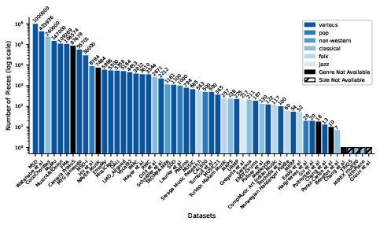

# Multimodal Music Datasets? Challenges and Future Goals in Music Processing

[](https://opensource.org/licenses/MIT)
[](https://doi.org/10.1007/s13735-024-00344-6)

[Anna-Maria Christodoulou](https://www.uio.no/ritmo/english/people/phd-fellows/annammc/index.html)<sup>1</sup>, 
[Olivier Lartillot](https://www.uio.no/ritmo/english/people/tenured/oliviel/index.html)<sup>1</sup>,
[Alexander Refsum Jensenius](https://www.uio.no/ritmo/english/people/management/alexanje/index.html)<sup>1</sup>,

<sup>1</sup> RITMO, UiO 


This repository contains information and supplementary materials for the paper titled "Defining Multimodal Music Datasets and Addressing Challenges in Their Construction and Evaluation."


## Abstract
The term "multimodal music dataset" is frequently utilized to depict music-related data representing music as a multimedia art form and a multimodal experience. However, the interpretation of "multimodality" can vary across related disciplines such as musicology, music psychology, and music technology. This paper proposes a comprehensive definition of multimodality that is applicable across different music disciplines. It addresses various challenges associated with constructing, evaluating, and utilizing multimodal music datasets. Additionally, the paper categorizes these datasets based on tasks and explores theoretical methodologies aimed at improving their future construction. It also sheds light on diverse data preprocessing methods and their contributions to transparent music analysis. Furthermore, evaluation metrics, methods, and benchmarks tailored for multimodal music processing tasks are scrutinized, empowering researchers to make informed decisions and facilitating cross-study comparisons.

## Multimodal music dataset definition

We propose to define multimodality as the deliberate integration of varied information sources tailored to specific tasks.

## TABLE 1: 

Overview of Multimodal Music Datasets Across Macro Tasks (Categories top to bottom: 1. Classification, 2. Time-Dependent Representation, 3. Similarity, 4. Generation, 5. Multi-Task). This table provides a comprehensive summary of specific tasks, modalities (AUD = audio, ANN = Annotation of Notes, ANO = Annotations of other music elements, IMG = Images, LAB = Labels, LYR = lyrics, MCP = Motion Capture, PHY = Physiological, MSC = Scores, TXD = Text Descriptions, VID = Video), and dataset examples within the Music Processing domain, offering insights into the diverse applications of multimodal approaches.

| Dataset Name | Modality | Number of Data | Specific Task | Macro Task |
|---|---|---|---|---|
| FMA | Audio | 106574 | Emotion/Affect Recognition | Classification |
| CAL500 | Audio | 500 | Genre Classification | Classification |
| EmoMV | Audio/Video | 5986 | Emotion/Affect Recognition | Classification |
| IMAC | Audio | 3812 | Music Gesture Classification | Classification |
| TROMPA-MER | Audio | 1161 | Emotion/Affect Recognition | Classification |
| MERP | Audio | 54 | Emotion/Affect Recognition | Classification |
| NAVER Music | Audio | 7484 | Emotion/Affect Recognition | Classification |
| PMEmo | Audio | 794 | Emotion/Affect Recognition | Classification |
| Hu et al. | Audio | 8784 | Genre Classification | Classification |
| Laurier et al. | Audio | 1000 | Emotion/Affect Recognition | Classification |
| Trochidis et al. | Audio | 100 | Genre Classification | Classification |
| Turnbull et al. | Audio | 500 | Genre Classification | Classification |
| LMD_Aligned | Audio | 5164 | Music Gesture Classification | Classification |
| MSD-I | Audio | 30000 | Singing Voice Analysis | Classification |
| MuMu | Audio | 147000 | Emotion/Affect Recognition | Classification |
| Mayer et al. | Audio | 3610 | Genre Classification | Classification |
| Orio et al. | Audio | 2671 | Genre Classification | Classification |
| Schnidler et al. | Audio | 2212 | Genre Classification | Classification |
| Turkish Makam Music | Audio | 257 | Genre Classification | Classification |
| CompMusic Art Indian Music | Audio | 117 | Emotion/Affect Recognition | Classification |
| Saraga Music Research | Audio | 563 | Genre Classification | Classification |
| Sarasua | Audio | 211 | Emotion/Affect Recognition | Classification |
| Chang et al. | Audio | 4453 | Auto-Tagging | Classification |
| Vocal92 | Audio | 4453 | Singing Voice Analysis | Classification |
| MTG Jamendo | Audio | 55701 | Genre Classification | Classification |
| CocoChorales | Audio | 240000 | Music Segmentation | Time-Dependent Representation |
| MUSIC21 | Audio | 365 | Music Generation | Music Generation |
| TRIOS | Audio | 7 | Music Transcription | Time-Dependent Representation |
| Benetos et al. | Audio | 13 | Source Separation | Time-Dependent Representation |
| Cheng et al. | Audio | 20 | Source Separation | Time-Dependent Representation |
| Hargreaves et al. | Audio | 217 | Music Segmentation | Time-Dependent Representation |
| Gregorio et al. | Audio | 87678 | Music Transcription | Time-Dependent Representation |
| Camera PrIMuS | Audio | 238 | Music Transcription | Time-Dependent Representation |
| MAPS | Audio | 60 | Music Transcription | Time-Dependent Representation |
| Norwegian Hardanger Fiddle | Audio | 20 | Music Transcription | Time-Dependent Representation |
| Gu et al. | Audio | 130 | Music Exploration and Discovery | Music Similarity |
| Poliner et al. | Audio | 10 | Music Exploration and Discovery | Music Similarity |
| Perez-Carillo et al. | Audio | 1000000 | Music Exploration and Discovery | Music Similarity |
| MSD | Audio | 109269 | Music Exploration and Discovery | Music Similarity |
| Music4AllOnion | Audio | 18 | Music Generation | Music Generation |
| Poltronieri et al. | Audio | 433936 | Music Generation | Music Generation |
| Watanabe et al. | Audio | 685 | Instrument Performance Analysis | Time-Dependent Representation |
| AtinPiano | Audio | 5500 | Piano Tutoring | Time-Dependent Representation |
| MUSIC | Audio | 225 | Song Retrieval | Music Similarity |
| MusiCaps | Audio | 5358 | Multi-Task | Multi-Task |
| URMP | Audio | 187 | Multi-Task | Multi-Task |
| Groux et al. | Audio | 122 | Multi-Task | Multi-Task |
| DALI | Audio | 3544 | Multi-Task | Multi-Task |
| ENST-Drums | Audio | 1100 | Multi-Task | Multi-Task |
| MedleyDB | Audio | 52 | Multi-Task | Multi-Task |
| RWC | Audio |  | Multi-Task | Multi-Task |
| SDD | Audio |  | Multi-Task | Multi-Task |
| Essid et al. | Audio |  | Multi-Task | Multi-Task |
# Dataset Availability




## Citation

If you find this useful for your research, please consider citing our work:

```bibtex
@article{christodoulou_multimodal_2024,
	title = {Multimodal music datasets? {Challenges} and future goals in music processing},
	volume = {13},
	issn = {2192-662X},
	shorttitle = {Multimodal music datasets?},
	url = {https://doi.org/10.1007/s13735-024-00344-6},
	doi = {10.1007/s13735-024-00344-6},
	number = {3},
	urldate = {2024-08-29},
	journal = {International Journal of Multimedia Information Retrieval},
	author = {Christodoulou, Anna-Maria and Lartillot, Olivier and Jensenius, Alexander Refsum},
	month = aug,
	year = {2024},
	pages = {37},
}
```

For any inquiries or suggestions, please contact [a.m.christodoulou@imv.uio.no].
